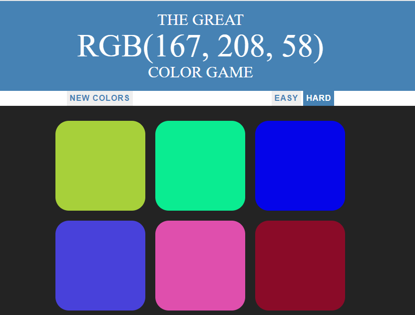

# Color Game

Simple game that consist in having to guess the color that is displayed in RGBA, build with CSS, HTML and JavaScript were it used JavaScript functions to control the DOM to add and remove classes following the guide in the Udemy course "The Web Developer Bootcamp!" created by Colt Steele.

This project

## Built With
- HTML
- CSS
- JavaScript

## Author

- 👤GitHub: [Jose Abel Ramirez](https://github.com/jose-Abel)

## Getting Started
You can clone this code anytime and load the HTML on your browser.

## Live version
https://frosty-goldberg-523a52.netlify.app/

### Setup
You can either copy the code with git clone, just do a git pull on your local environment or just load the HTML on your browser since it was build with vanilla JavaScript doesn't require any installation.

### Acknowledgments
Appreciate the teams at Udemy and the creator of the course Colt Steele since allows me to learn a lot of JavaScript and the DOM.

## 📝 License
This project is MIT licensed.

## Show your support
Give a ⭐️ if you like this project!